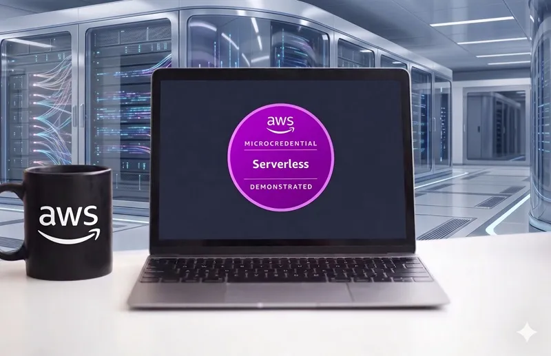
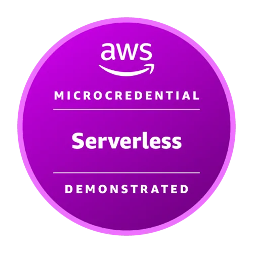

<p align="center">
  
</p>

<h1 align="center">AWS Serverless Demonstrated — Exam Lab na Prática</h1>

<p align="center">
  
</p>

<p align="center">
  
  
  
  
</p>

---

> 🏅 **Microcredencial da AWS Skills Builder** | Foco: Arquiteturas Serverless

Repositório de registro e evidências da microcredencial **AWS Serverless Demonstrated**, obtida através de um Exam Lab prático no qual corrigi, configurei e fortaleci uma plataforma de e-commerce serverless com **7 desafios interdependentes**, diretamente no console AWS.

## 📖 Artigo Completo

> Este README é apenas um resumo.  
> A análise completa — com o passo a passo de cada desafio, decisões técnicas e principais aprendizados — está no blog:

**👉 [AWS Serverless Demonstrated — Exam Lab na Prática](https://labs.caiocesar.tec.br/2026/06/27/aws-serverless-demonstrated-exam-lab/)**

---

## 🧩 Serviços AWS Utilizados

| Serviço                   | Finalidade                                                  |
| ------------------------- | ----------------------------------------------------------- |
| **AWS Lambda**            | 6 funções de domínio (produtos, carrinho, pedidos, notif.)  |
| **Amazon API Gateway**    | API REST com integração de proxy e CORS                     |
| **Amazon Cognito**        | Autenticação e autorização de usuários                      |
| **AWS WAF**               | Regras gerenciadas de proteção da API                       |
| **Amazon DynamoDB**       | Persistência de carrinho e pedidos                          |
| **AWS Step Functions**    | Orquestração assíncrona com tratamento robusto de erros     |
| **Amazon SQS**            | Fila de mensagens para desacoplamento                       |
| **Amazon SNS**            | Notificações automáticas de pedidos e inscrições            |
| **AWS CodePipeline**      | CI/CD com etapa de aprovação manual                         |
| **Amazon VPC**            | Isolamento de rede para funções Lambda                      |

---

## 📋 Os 7 Desafios

| #   | Desafio                                                 | Serviços-chave                       |
| --- | ------------------------------------------------------- | ------------------------------------ |
| A   | CI/CD com CodePipeline para atualizar Lambda incompleta | CodePipeline, Lambda                 |
| B   | Configuração do Amazon API Gateway                      | API Gateway, Lambda                  |
| C   | Configuração do Amazon Cognito + SNS                    | Cognito, SNS                         |
| D   | Segurança de API com Cognito + AWS WAF                  | Cognito, WAF, API Gateway            |
| E   | Persistência do carrinho de compras                     | DynamoDB, Lambda                     |
| F   | Finalização de pedidos com Step Functions               | Step Functions, SQS, SNS, DynamoDB   |
| G   | Limites de rede com VPC para Lambda                     | VPC, Lambda                          |

---

## 📁 Estrutura do Repositório

```
.
├── assets/                           # Imagens e recursos visuais
│   ├── Serverless.webp               # Banner do repositório
│   └── serverless-demonstrated.webp  # Badge da microcredencial
├── .gitignore                        # Regras de exclusão do Git
├── LICENSE                           # Licença MIT
└── README.md                         # Este arquivo
```

---

## 🏆 Credencial

<p align="center">
  
</p>

- **Microcredencial:** AWS Serverless Demonstrated
- **Plataforma:** AWS Skills Builder — Exam Lab
- **Modalidade:** Prática (hands-on no console AWS)

---

## 📄 Licença

Este projeto está licenciado sob a [MIT License](LICENSE).

---

<p align="center">
  📌 <em>Repositório com fins de portfólio e estudo pessoal.<br/>Não contém código proprietário do laboratório AWS Skills Builder.</em>
</p>

---

## 🔗 Referências

- [AWS Skill Builder — Microcredentials](https://explore.skillbuilder.aws/learn/public/learning_plan/view/2070/microcredentials)
- [Artigo completo no blog](https://labs.caiocesar.tec.br/2026/06/27/aws-serverless-demonstrated-exam-lab/)
